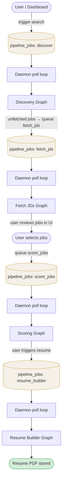
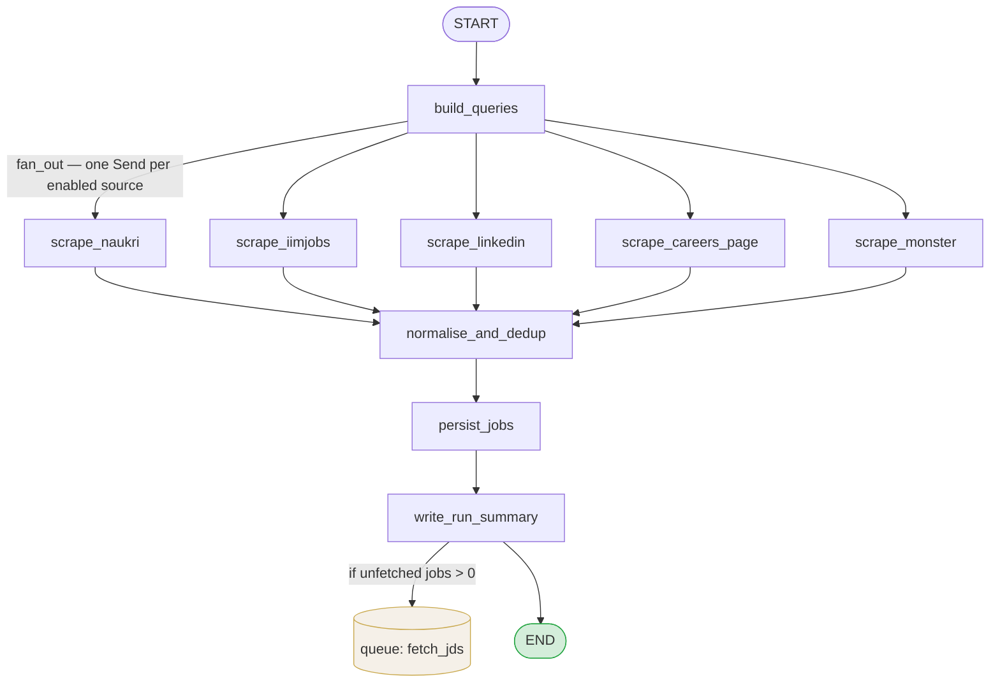
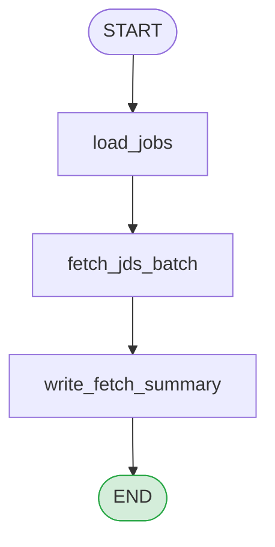
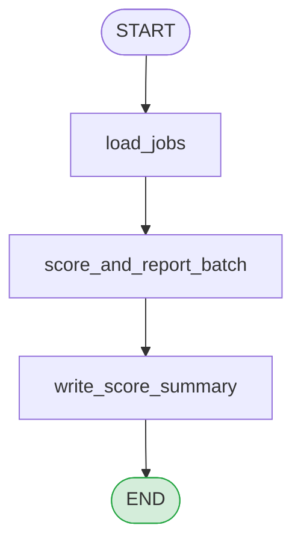
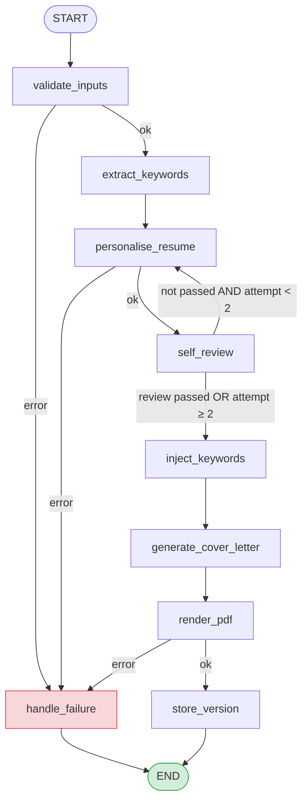

# Agent Workflow

Diagrams of all LangGraph graphs in the Proxim agent and how they chain together.

---

## Overall Pipeline Flow

Graphs are never invoked directly by each other. They communicate through the database queue — the daemon polls every 3 seconds, claims the next queued job, and dispatches it to the right graph.

---

## Discovery Graph

Builds search queries, fans out to all enabled job boards in parallel, deduplicates, then persists.

> `fan_out` is a conditional edge that emits one `Send` per enabled source in `preferences.enabled_sources`. Disabled sources are skipped entirely. All scrapers run in parallel and their `raw_jobs` lists are merged via `operator.add`.

---

## Fetch JDs Graph

Loads jobs that have no JD text yet and fetches their full descriptions from source URLs.

> After this graph completes, the pipeline **waits for user action** — the candidate reviews discovered jobs in the UI and selects which to score.

---

## Scoring Graph

Scores a batch of jobs (all ready jobs, or a user-selected subset) against the candidate's profile.

> `state.job_ids` is an optional list of specific job IDs to score. When empty, all `fetch_ready` jobs for the candidate are scored.

---

## Resume Builder Graph

Tailors the candidate's base resume to a specific job, runs a self-review loop, injects keywords, generates a cover letter, and renders the final PDF.

> `self_review` retries `personalise_resume` up to **2 times** if the LLM self-review fails. On the third attempt it forces forward to `inject_keywords` regardless (FR-014).

---

## Non-Graph Pipelines (node sequences in daemon)

These job types run as direct node-function sequences inside `daemon.py` — no compiled `StateGraph`.

| Job type | Steps |
|---|---|
| `linkedin_connector` | check_dnc → extract_hiring_team → discover_contact → enrich_profile → research_contact → generate_notes |
| `linkedin_note_regen` | enrich_profile → research_contact → generate_notes |
| `outreach_mailer` | discover_email → generate_emails → write_cadence_checkpoint |
| `outreach_mailer_generate` | generate_emails → write_cadence_checkpoint |
| `import_jobs` | fetch LinkedIn JDs → update job meta → queue score_jobs |
